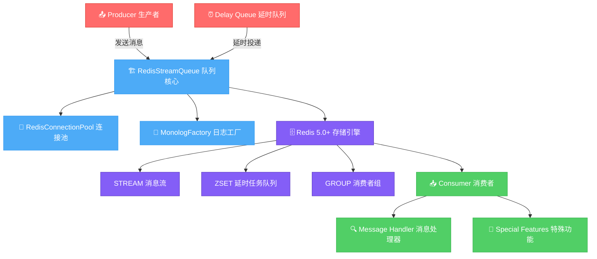

# 🚀 Redis Stream Queue

[](https://packagist.org/packages/tinywan/redis-stream)
[](https://packagist.org/packages/tinywan/redis-stream)
[](https://packagist.org/packages/tinywan/redis-stream)
[](https://www.php.net)
[](https://redis.io)
[](https://github.com/Tinywan/redis-stream/actions)

> 🚀 基于 Redis Streams 的高性能轻量级 PHP 队列

## ✨ 特性

- ⚡ **高性能** - 基于 Redis 5.0+ Stream，支持高并发
- ⏰ **延时任务** - 基于 Sorted Set，支持秒级到年级延时
- 🔄 **多生产者/消费者** - 支持多个生产者和消费者同时工作
- 💾 **消息持久化** - 可靠的消息持久化存储
- ✅ **ACK 确认机制** - 完善的消息确认机制
- 🔄 **智能重试** - 可配置的重试次数和延迟策略
- 🔄 **消息重放** - 支持重新处理历史消息
- 🔍 **消息审计** - 提供只读模式审计所有消息
- 🧪 **完整测试** - 69个测试，244个断言，100%通过率
- 📝 **PSR-3 日志** - 标准 PSR-3 日志接口
- 🏗️ **单例模式** - 单例模式支持，避免重复创建实例

## 📋 环境要求

- **PHP** >= 7.4
- **Redis** >= 5.0
- **Composer** >= 2.0
- **ext-redis** 扩展

## 🚀 快速安装

```bash
composer require tinywan/redis-stream
```

## 🎯 快速开始

### 基础使用

创建队列实例
```php
<?php
require_once __DIR__ . '/vendor/autoload.php';

use Tinywan\RedisStream\RedisStreamQueue;
$queue = RedisStreamQueue::getInstance();
```

发送消息
```php
<?php
$messageId = $queue->send('Hello, Redis Stream!');
echo "Message ID: $messageId\n";
```

消费消息
```php
<?php
// 消费消息
$message = $queue->consume(function($message) {
    echo "Processing: " . $message['message'] . "\n";
    return true; // 确认消息
});
```

### 使用 Producer 和 Consumer

```php
use Tinywan\RedisStream\RedisStreamQueue;
use Tinywan\RedisStream\Producer;
use Tinywan\RedisStream\Consumer;

// 创建队列实例
$queue = RedisStreamQueue::getInstance();

// 生产者
$producer = new Producer($queue);
$messageId = $producer->send('Task data', [
    'task_type' => 'email'
], 10); // 延迟10秒

// 消费者
$consumer = new Consumer($queue);
$consumer->run(function($message) {
    $task = json_decode($message['message'], true);
    return handleTask($task['type'], $task['data']);
});
```

## 📊 架构流程



### 核心组件

| 层级 | 组件 | 功能描述 |
|------|------|----------|
| **📤 生产者层** | Producer | 高级消息发送接口，支持单条和批量发送 |
| | Delay Queue | 基于 Redis Sorted Set 的延时任务队列 |
| **🏗️ 队列核心层** | RedisStreamQueue | 主要队列类，处理 Redis 连接和消息生命周期 |
| | RedisConnectionPool | Redis 连接池管理器，自动连接复用 |
| | MonologFactory | Monolog 日志工厂，支持多种日志方式 |
| **🗄️ 存储层** | Redis Stream | Redis 5.0+ 消息流，持久化消息存储 |
| | Sorted Set | 延时任务队列，按时间戳排序 |
| | Consumer Group | 消费者组管理，支持并行消费 |
| **📥 消费者层** | Consumer | 高级消息消费接口，具有重试逻辑和内存管理 |
| | Message Handler | 自定义消息处理器接口 |
| | Special Features | 消息重放、审计、指定位置消费等高级功能 |

### 数据流向图

```
┌─────────────────┐    ┌─────────────────┐    ┌─────────────────┐
│   生产者 Producer   │    │  延时队列 Delay   │    │ 消息 Message    │
│                 │    │     Queue        │    │                 │
│ • 单条发送       │    │ • Sorted Set     │    │ • 业务数据       │
│ • 批量发送       │    │ • 时间戳 Score    │    │ • 元数据         │
│ • 即时/延时      │    │ • 定时调度        │    │ • 优先级         │
└─────────┬───────┘    └─────────┬───────┘    └─────────┬───────┘
          │                      │                      │
          └──────────────────────┼──────────────────────┘
                                 │
                    ┌─────────────▼─────────────┐
                    │   RedisStreamQueue 核心   │
                    │                           │
                    │ • 单例模式               │
                    │ • 连接池管理              │
                    │ • 消息确认机制            │
                    │ • 重试逻辑                │
                    │ • PSR-3 日志              │
                    └─────────────┬─────────────┘
                                 │
                    ┌─────────────▼─────────────┐
                    │    Redis 5.0+ 存储       │
                    │                           │
                    │ ┌─────────┬─────────────┐  │
                    │ │STREAM   │ ZSET        │  │
                    │ │消息流   │ 延时队列     │  │
                    │ │XADD    │ 时间戳       │  │
                    │ │XREAD   │ 定时调度      │  │
                    │ └─────────┴─────────────┘  │
                    │                           │
                    │ ┌─────────┬─────────────┐  │
                    │ │GROUP    │ 消费者组     │  │
                    │ │消费组   │ 并行处理      │  │
                    │ │ACK/NACK │ 消息确认      │  │
                    │ └─────────┴─────────────┘  │
                    └─────────────┬─────────────┘
                                 │
          ┌──────────────────────┼──────────────────────┐
          │                      │                      │
┌─────────▼───────┐    ┌─────────▼───────┐    ┌─────────▼───────┐
│   Consumer 消费者 │    │ Message Handler │    │ Special Features │
│                 │    │   消息处理器      │    │    特殊功能       │
│ • 长连接消费     │    │ • 自定义处理      │    │ • 消息重放        │
│ • 自动重试       │    │ • 业务解耦        │    │ • 消息审计        │
│ • 内存管理       │    │ • 错误处理        │    │ • 指定位置消费     │
│ • 进程监控       │    │ • 异常捕获        │    │ • 灵活消费模式     │
└─────────────────┘    └─────────────────┘    └─────────────────┘
```

### 核心特性说明

**🔄 消息流转过程**
1. **生产者**发送消息到队列核心
2. **延时队列**处理需要延迟的消息
3. **队列核心**管理连接池和消息生命周期
4. **Redis存储**提供持久化和消费组管理
5. **消费者**接收消息并调用处理器
6. **特殊功能**提供消息重放、审计等高级操作

**⚡ 性能优化**
- 单例模式避免重复创建实例
- 连接池管理减少连接开销
- Redis Stream提供高性能消息存储
- 支持多消费者并行处理

## 📖 主要功能

### 延时消息

支持秒级到年级的任意时长延时：

```php
// 立即执行
$queue->send('Immediate message');

// 延时执行（30秒后）
$queue->send('Delayed message', [], 30);

// 定时执行（1小时后）
$timestamp = time() + 3600;
$queue->send('Scheduled message', [], $timestamp);

// 年级延时（1天后）
$queue->send('Next day message', [], 86400);
```

### 消息重放与审计

支持重新处理历史消息和只读审计：

```php
// 重放消息，最多处理10条，自动确认
$count = $queue->replayMessages(function($message) {
    echo "Replaying: " . $message['message'] . "\n";
    return true;
}, 10);

// 审计消息（只读模式，不影响消息状态）
$count = $queue->auditMessages(function($message) {
    echo "Auditing: " . $message['message'] . "\n";
    return true;
}, 20);
```

### 指定位置消费

灵活的消费位置控制：

```php
// 从头开始读取所有消息
$message = $queue->consume(null, '0-0');

// 读取最新消息
$message = $queue->consume(null, '$');

// 从指定消息ID开始读取
$message = $queue->consumeFrom('1758943564547-0');
```

## ⚙️ 配置

### Redis 配置

```php
$redisConfig = [
    'host' => '127.0.0.1',
    'port' => 6379,
    'password' => null,
    'database' => 0,
    'timeout' => 5,
];
```

### 队列配置

```php
$queueConfig = [
    'stream_name' => 'redis_stream_queue',
    'consumer_group' => 'redis_stream_group',
    'consumer_name' => 'consumer_' . getmypid(),
    'block_timeout' => 5000,
    'retry_attempts' => 3,
    'retry_delay' => 1000,
    'delayed_queue_suffix' => '_delayed',
    'scheduler_interval' => 1,
];
```

## 🚀 生产部署

### Supervisor 配置

```ini
[program:redis-stream-consumer]
command=php /path/to/your/project/examples/consumer.php
directory=/path/to/your/project
autostart=true
autorestart=true
user=www-data
redirect_stderr=true
stdout_logfile=/var/log/supervisor/redis-stream-consumer.log
```

### Docker 部署

```dockerfile
FROM php:8.1-cli
RUN pecl install redis && docker-php-ext-enable redis
COPY --from=composer:latest /usr/bin/composer /usr/bin/composer
COPY . /app
WORKDIR /app
RUN composer install --no-dev --optimize-autoloader
CMD ["php", "examples/consumer.php"]
```

## 📊 性能基准

| 操作 | QPS | 延迟 (P95) |
|------|-----|-----------|
| 发送消息 | 50,000+ | 2ms |
| 消费消息 | 30,000+ | 3ms |
| 延时消息调度 | 100,000+ | 1ms |

*测试环境：Intel i7-10700K, Redis 7.0, PHP 8.1*

## 🔧 高级功能

### 单例模式管理

```php
// 获取实例状态
$status = RedisStreamQueue::getInstancesStatus();

// 获取连接池状态
$poolStatus = $queue->getConnectionPoolStatus();
```

### 延迟队列管理

```php
// 获取延迟队列统计
$stats = $queue->getDelayedQueueStats();

// 手动运行调度器
$processedCount = $queue->runDelayedScheduler(100);

// 启动调度器（运行60秒）
$queue->startDelayedScheduler(60);
```

### 队列监控

```php
// 获取队列状态
$status = [
    'stream_length' => $queue->getStreamLength(),
    'pending_count' => $queue->getPendingCount(),
    'delayed_count' => $queue->getDelayedQueueLength(),
];
```

## 🛠️ 框架集成

### Laravel 集成

```php
// config/queue.php
'connections' => [
    'redis-stream' => [
        'driver' => 'redis-stream',
        'connection' => 'default',
        'queue' => env('REDIS_QUEUE', 'default'),
    ],
],
```

### ThinkPHP 集成

```php
use Tinywan\RedisStream\RedisStreamQueue;
use Tinywan\RedisStream\Producer;

class QueueService
{
    public function sendEmail($to, $subject, $delay = 0)
    {
        $queue = RedisStreamQueue::getInstance();
        $producer = new Producer($queue);
        return $producer->send(json_encode([
            'to' => $to, 'subject' => $subject
        ]), ['type' => 'email'], $delay);
    }
}
```

## ❓ 常见问题

**Q: 如何处理消息丢失？**
A: 启用 Redis 的 AOF 或 RDB 持久化，使用消费者组确保消息被正确确认。

**Q: 延时消息的精度如何？**
A: 默认检查间隔为 1 秒，支持秒级到年级的任意时长延时。

**Q: 如何处理高并发场景？**
A: 使用单例模式，配置合适的连接池大小，使用多个消费者进程并行处理。

**Q: 如何监控队列状态？**
A: 使用 `getStreamLength()`、`getPendingCount()`、`getDelayedQueueLength()` 等方法监控状态。

## 🧪 运行示例

```bash
# 基础示例
php examples/quickstart.php

# 生产者示例
php examples/producer.php

# 消费者示例
php examples/consumer.php

# 运行测试
./vendor/bin/phpunit
```

## 🤝 贡献

欢迎贡献代码！请遵循 PSR-12 编码规范，添加适当的测试，确保所有测试通过。

1. Fork 仓库
2. 创建功能分支 (`git checkout -b feature/AmazingFeature`)
3. 提交更改 (`git commit -m 'Add some AmazingFeature'`)
4. 推送分支 (`git push origin feature/AmazingFeature`)
5. 打开 Pull Request

## 📄 开源协议

本项目采用 MIT 协议开源。详情请查看 [LICENSE](LICENSE) 文件。

---

<div align="center">
Made with ❤️ by <a href="https://github.com/Tinywan">Tinywan</a>
</div>